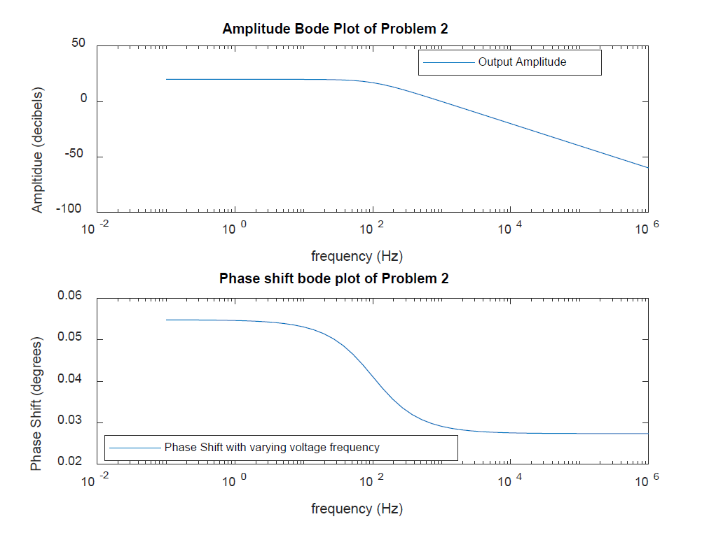
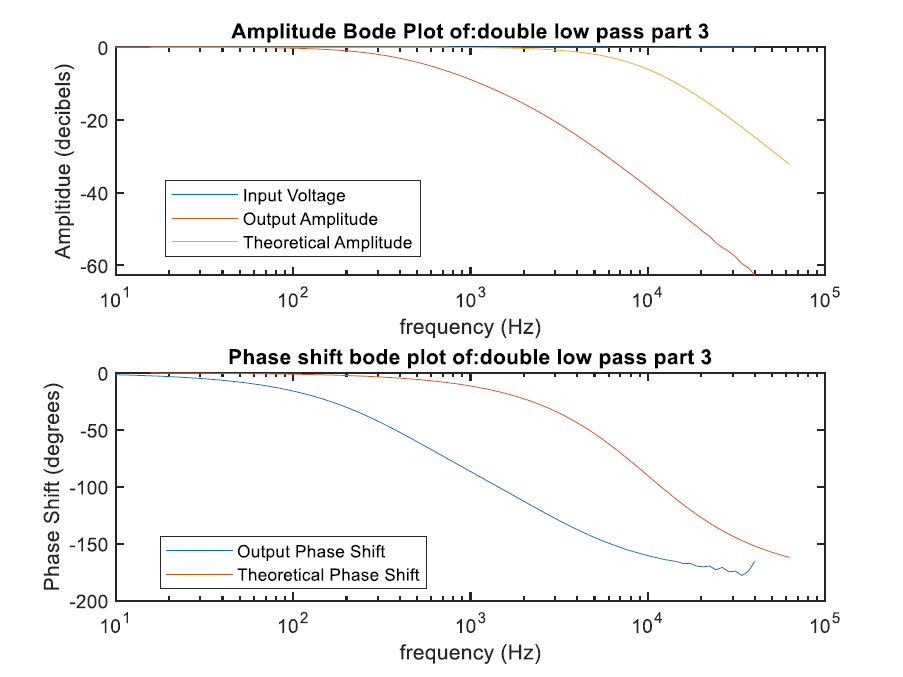

Bode Plot Folder
=============
+ Imaginary Bode Plot Example
	+ This function plots a bode plot of a circuit given the graph title, a vector of frequenices, and a vector of complex numbers
	+ 
+ Real Bode Plot Example
	+ Generates a bode plot of a circuit given the grpah title and a file of network analyzer data from waveforms
	+ 
+ Theoeretical Bode Plot Example
	+ adds the amplitude and phase shifts to an existing bode plot given vectors of frequenices, amplitudes, and phase shifts
	+ 
+  Written by Jacob Smith 
	+ jsmith2021@brandeis.edu