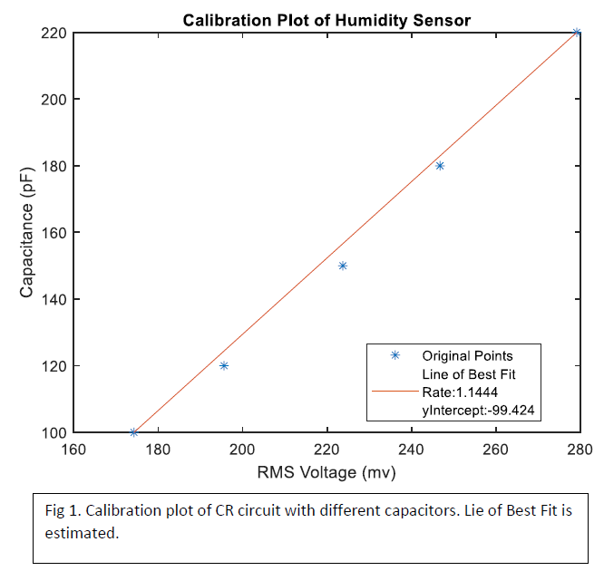
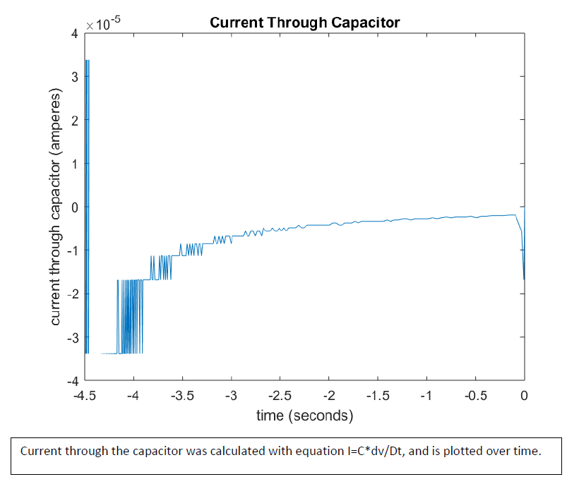

Bode Plot Folder
=============
+ Calibration Plot Example
	+ This plot combines the genCalibrationPlot and addLineOfFit functions to plot two vectors of related measurments and add a rough line of fit
	+ 
+ Derivative Plot Example
	+ Plots the change in y vector over change in x vector given those, plus title and axis names
	+ 

+  Written by Jacob Smith 
	+ jsmith2021@brandeis.edu