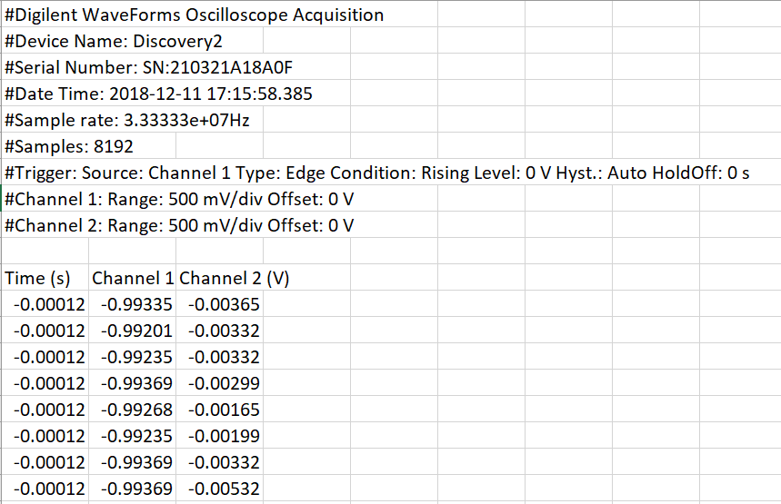

File Input Folder
=============
+ These functions allow the oscilloscope data from an instrument in waveforms to be used properly
	+ 
	+ The readFile function finds the row to read the file at after the header
	+ The startZero function sets the time column to start at 0, because it doesn't here

+  Written by Jacob Smith 
	+ jsmith2021@brandeis.edu