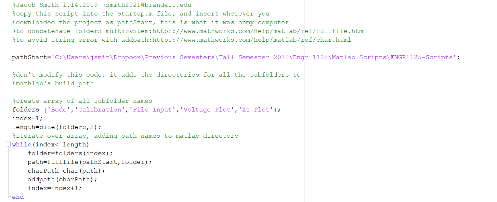
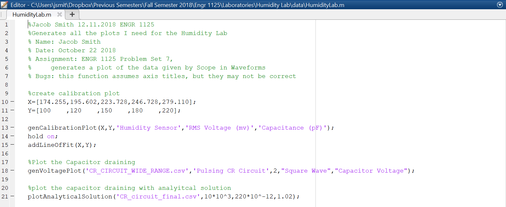
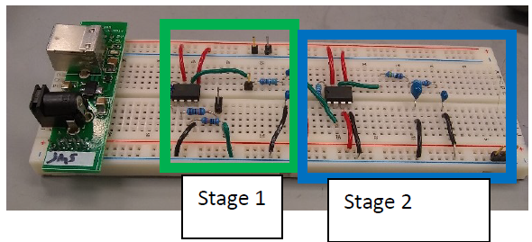

ENGR 1125 Matlab Library
=============
+ This Library of functions generates [Matlab](https://www.mathworks.com/products/matlab.html) plots useful in my Introduction to Sensors Instrumentation and Measurment Class, including
	+ bode plots 
	+ XY plots
	+ calibration plots
	+ reading csv files, without requirement that file is all numbers
+ I also included an Excel spreadsheet that is used to calculate the resistor and capacitor values in a band pass filter
+ The functions all read csv files from sesnsor data generates in the [waveforms](https://reference.digilentinc.com/reference/software/waveforms/waveforms-3/start) software
+ [The class website](http://isim.olin.edu/index.shtml)  
+ How to use this library:
	1. Download the project and unzip it
	2. In the [startup file in matlab](https://www.mathworks.com/help/matlab/matlab_env/add-folders-to-matlab-search-path-at-startup.html), copy the contents of the INSERTSTARTUP file
		+ and change the startPath to where you installed the project
	    + for me it would be:
		+ 
	3. Now you can write Matlab scripts using these functions, such as this one, which creates a calibration plot and a bode plot
		+ 
+  Written by Jacob Smith 
	+ jsmith2021@brandeis.edu
+ 