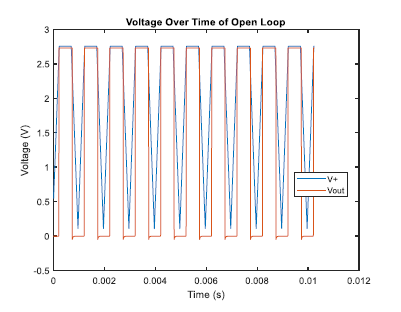

Voltage Plot Folder
=============
+ Voltage Plot Example
	+ This plot graphs the voltage of a circuit over time given a file of oscilloscope data from waveforms
	+ 

+  Written by Jacob Smith 
	+ jsmith2021@brandeis.edu